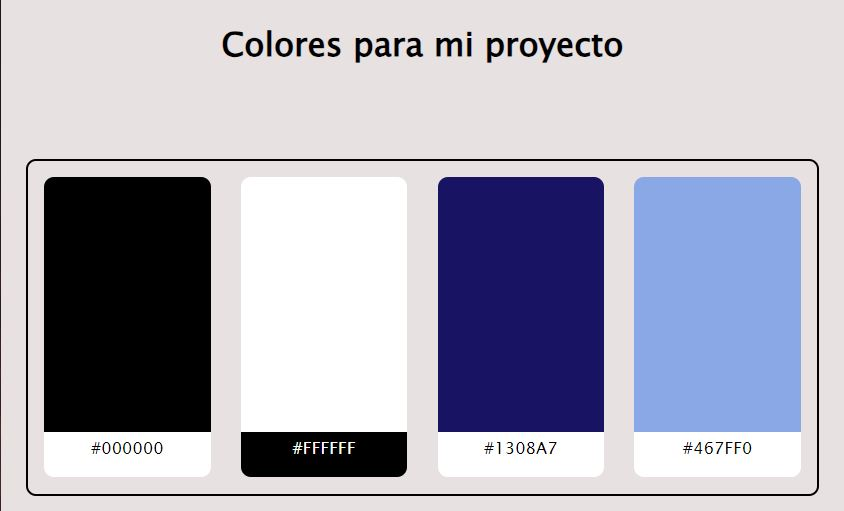

# Entregable colores

# Diseño de Interfaces Web

## Autor: Estefania Ortega Muñoz

### El color es una herramienta muy útil para crear una identidad de marca y desencadenar emociones específicas en los usuarios. He elegido colores blanco y negro por el contraste que hacen, son colores simples, dan claridad a la aplicación y la hace legible para el usuario, el color blanco en concreto implica limpieza y transparencia, después he agregado el color azul por que es un color que transmite confianza y compromiso que es el objetivo de la aplicación. Los tonos azules seran para fondo de página y el blanco y negro para fuentes y botones.

[Enlace a fichero HTML](colores.html)
