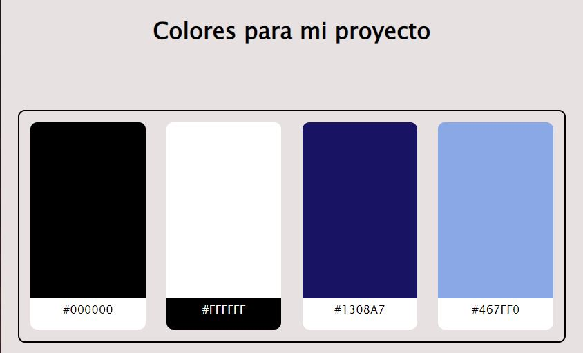

# Entregable colores

# Diseño de Interfaces Web

## Autor: Estefanía Ortega Muñoz

### El color es una herramienta fundamental para crear una identidad de marca y desencadenar emociones específicas en los usuarios. He elegido los colores blanco y negro por el contraste que ofrecen. Son colores simples que aportan claridad a la aplicación y la hacen legible para el usuario. El color blanco, en particular, implica limpieza y transparencia. Además, he agregado el color azul porque transmite confianza y compromiso, que es el objetivo de la aplicación. Los tonos azules se utilizarán para el fondo de la página, mientras que el blanco y negro se emplearán para las fuentes y los botones.

## Fondo: Azul claro

## Fuente: Negro

## Botones: Blanco y azul

[Enlace a fichero HTML](colores.html)
