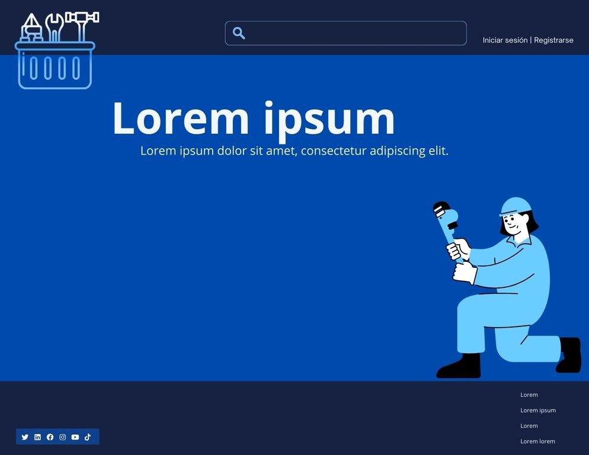
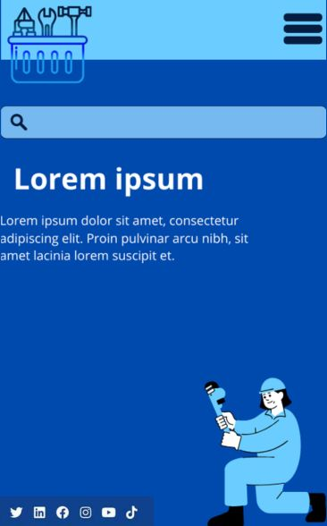

# Propuesta Gráfica

# Diseño de Interfaces Web

## Autor: Estefanía Ortega Muñoz

### Versión Desktop

La idea de la aplicación es un marketplace de servicios del hogar donde los profesionales ofrecen sus servicios y los clientes los contactan directamente vía whatsapp.

He ajustado ligeramente los tonos elegidos por cuestiones de legibilidad. Esto me lleva a reflexionar que seleccionar los colores antes de tener un prototipo puede ser algo relativo; no sabes exactamente cómo se verá hasta que observes más detalladamente la disposición de los elementos, el tipo de fuente, etc.

A primera vista, el diseño me parece quizás demasiado simple. La cabecera incluye un logo provisional ubicado finalmente a la izquierda, aunque inicialmente consideré colocarlo a la derecha saliendo de los estándares. Decidí situarlo a la izquierda finalmente.
Además, el logo sobresale ligeramente de la cabecera para hacerlo más visible.

En el centro de la cabecera, he colocado un buscador pensado para que el usuario pueda realizar búsquedas específicas, como por ejemplo: "Fontaneros en Sevilla". La idea es que, al realizar la búsqueda, el usuario acceda a una página con un listado de profesionales ordenado por valoraciones, de mayor a menor, permitiendo contactar directamente con ellos a través de WhatsApp.

A la derecha del buscador, hay un enlace para Iniciar sesión/Registro de usuarios. Este enlace pedirá al usuario identificar si es un profesional o un cliente, mostrando opciones adaptadas según el tipo de usuario.

En el cuerpo de la página, a modo de título, se encuentra el nombre de la empresa acompañado de un eslogan (aún por definir).

En la parte inferior del cuerpo, a la derecha, hay una imagen que refuerza el propósito de la página.

Finalmente, en el pie de página, se han añadido enlaces a redes sociales y otros enlaces relevantes alineados a la derecha.

### Versión móvil

Al ser un espacio mucho más reducido, tenemos:

Cabecera con el logo a la izquierda y a la derecha el menú hamburguesa que desplegaría las opciones de inicio de sesión.

Debajo de la cabecera, a todo lo ancho, el buscador.

Nombre de la empresa, eslógan e imagen indentificativa.

He prescindido del pié de página, a cambio puse un pequeño banner con las redes sociales.

